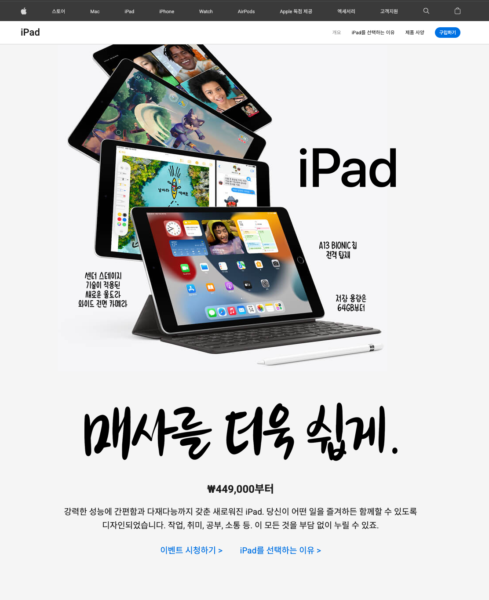
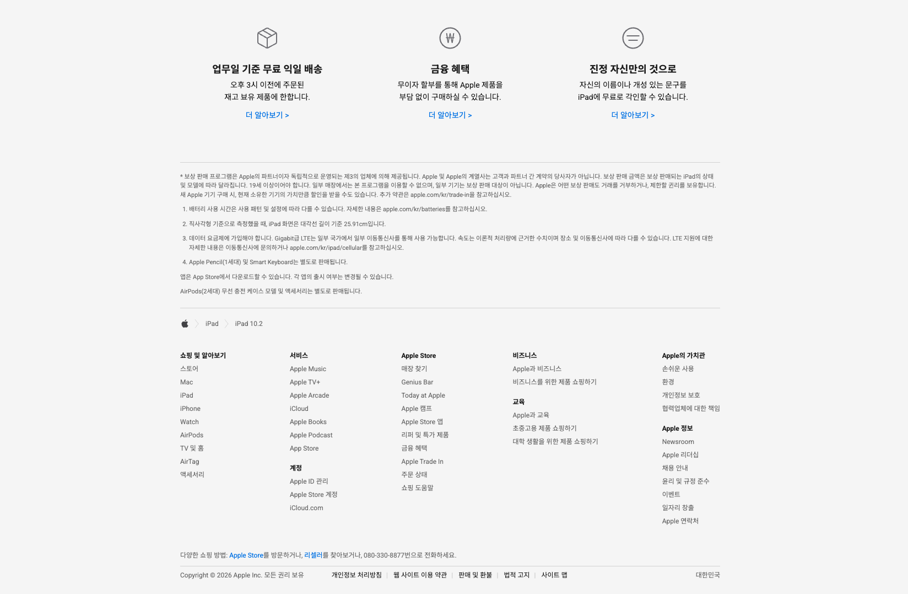

# iPad 10.2 - Apple (KR) Clone

Apple Korea 공식 홈페이지의 iPad 10.2 제품 소개 페이지(`apple.com/kr/ipad-10.2`)를 그대로 재현한 반응형 퍼블리싱 클론 코딩 프로젝트입니다. 프레임워크 없이 순수 HTML/CSS/JavaScript(ES Module)만으로 애플 특유의 인터랙션과 반응형 레이아웃을 구현하는 데 초점을 맞췄습니다.

배포: [배포_URL](https://ipad-homepage.vercel.app/)

**Stack**: HTML5, CSS3, Vanilla JavaScript (ES Modules), Prettier

**기간**: 2026.07.07 – 2026.07.13 · 1인 개발

---

## 프로젝트 소개

애플 공식 사이트의 마크업/스타일/모션을 픽셀 단위로 분석하고 그대로 구현해보며, 실무형 반응형 퍼블리싱 역량을 기르기 위해 진행한 클론 코딩 프로젝트입니다.

- 헤더 검색바 · 장바구니 드롭다운 · 글로벌 내비게이션 메뉴 토글 등 애플 특유의 인터랙션 재현
- Hero부터 Footer까지 15개 이상의 섹션을 데스크톱(1000px 초과) / 태블릿(741~1000px) / 모바일(740px 이하) 3단 브레이크포인트로 반응형 대응
- Sprite Image 애니메이션, `IntersectionObserver` 기반 스크롤 등장 애니메이션, 비디오 재생 제어 등 순수 JS로 모션 구현
- 제품 비교 목록과 푸터 내비게이션을 JS 데이터 모듈로 동적 렌더링

**왜 만들었는가**
정적인 페이지를 그대로 베끼는 것을 넘어, 실제 서비스 수준의 미세한 상호작용(트랜지션 딜레이, 스크롤 잠금, 브레이크포인트별 마크업 차이 등)을 뜯어보고 재현하며 반응형 퍼블리싱 실력을 검증하기 위해 만들었습니다.

---

## 스크린샷

| 화면 1                                   | 화면 2                                   | 화면 3                                   |
|----------------------------------------|----------------------------------------|----------------------------------------|
|  |  |  |

---


## 기술 스택

| 구분 | 기술 | 비고 |
|---|---|---|
| 마크업 | HTML5 | Open Graph / Twitter Card 메타 태그 포함 |
| 스타일 | CSS3 (Vanilla) | CSS 변수(`:root` 커스텀 프로퍼티)로 색상 토큰 관리, `@media`로 반응형 처리 |
| 스크립트 | Vanilla JavaScript (ES Modules) | 프레임워크 없이 DOM API만으로 인터랙션 구현 |
| 폰트 | Google Fonts (Noto Sans KR, Roboto) | |
| 리셋 | reset-css (CDN) | |
| 포매팅 | Prettier | `tabWidth: 2`, `singleQuote`, `printWidth: 120` |

---

## 프로젝트 구조

```
ipad-homepage/
├── index.html          # 전체 페이지 마크업 (헤더 ~ 푸터, 15개 섹션)
├── css/
│   └── main.css         # 전역 스타일 + 섹션별 스타일 + 반응형 미디어쿼리
├── js/
│   └── main.js           # 헤더/내비게이션 인터랙션, 스크롤 애니메이션, 데이터 렌더링
├── data/
│   ├── ipads.js           # '당신에게 맞는 iPad는?' 비교 섹션용 제품 데이터
│   └── navigations.js     # 푸터 사이트맵 내비게이션 데이터
├── images/              # 섹션별 이미지 · 스프라이트 · 아이콘 (100여 개)
├── videos/
│   └── center-stage.mp4  # 카메라 섹션 센터 스테이지 소개 영상
├── favicon.ico
├── .prettierrc / .prettierignore
└── .gitignore
```

---

## 주요 섹션 구성

`index.html` 기준 상단부터 순서대로 구성된 섹션입니다.

| 섹션 | 설명 |
|---|---|
| Header / Navigation | Apple 글로벌 헤더, 검색바 애니메이션, 장바구니 드롭다운, iPad 서브 내비게이션(개요/iPad를 선택하는 이유/비교하기/구입 등 앵커 메뉴) |
| Hero | 제품 메인 비주얼, Figures 공통 레이아웃 |
| Power | A13 Bionic 칩 소개, Sprite Image 프레임 애니메이션 |
| Display | Liquid Retina 디스플레이, True Tone 소개 |
| Camera | 카메라 하드웨어 및 센터 스테이지 영상(`center-stage.mp4`) 재생/일시정지 컨트롤 |
| Wireless | Wi-Fi 6, 5G 등 연결성 소개 |
| Accessories | Apple Pencil / Smart Keyboard 액세서리 소개 |
| iPadOS | iPadOS 기능 소개 |
| Apps | Adobe, Books, GoodNotes, Masterclass 등 앱 생태계 소개 |
| Privacy | 개인정보 보호 정책 소개 |
| Accessibility | 손쉬운 사용 기능 소개 |
| AR / Environment | 증강현실 및 친환경 소재 소개 (Whitebox 공통 스타일 적용) |
| Accessory-shop / Trade | 액세서리 구매, Apple Trade In 유도 섹션 |
| Compare | `data/ipads.js` 기반으로 렌더링되는 iPad 라인업 비교 카드 |
| Footer | 각주(Footnote), Breadcrumbs, `data/navigations.js` 기반 사이트맵 아코디언 메뉴, 저작권 연도 자동 표시 |

---

## 핵심 인터랙션 (JavaScript)

- **장바구니 드롭다운**: 클릭 토글 + 외부 클릭 시 닫힘(`stopPropagation` 처리)
- **검색바**: 열림/닫힘 시 헤더 메뉴 항목과 검색 결과 li에 순차적인 `transitionDelay`를 부여해 계단식 애니메이션 구현, 모바일 전용 검색 모드 별도 처리
- **글로벌/서브 내비게이션 메뉴 토글**: 모바일 환경에서 햄버거 메뉴 및 iPad 서브 메뉴 토글, 열림 시 `html.fixed`로 배경 스크롤 잠금
- **스크롤 등장 애니메이션**: `IntersectionObserver`로 `.info` 요소를 관찰하다가 뷰포트에 들어오면 `show` 클래스 부여
- **비디오 컨트롤**: 카메라 섹션 영상의 재생/일시정지 버튼 토글
- **데이터 기반 동적 렌더링**:
  - `data/ipads.js` → Compare 섹션 상품 카드(썸네일, 색상 스와치, 이름, 가격, 링크) 렌더링
  - `data/navigations.js` → 푸터 사이트맵을 `map` 블록으로 렌더링, 클릭 시 아코디언처럼 펼침/접힘 토글
- **연도 자동화**: 푸터 저작권 표기의 연도(`span.this-year`)를 현재 연도로 자동 갱신

---

## 반응형 브레이크포인트

| 브레이크포인트 | 대상 |
|---|---|
| `> 1000px` | 데스크톱 |
| `~ 1000px` | 태블릿 |
| `~ 740px` | 모바일 |

거의 모든 섹션이 `max-width: 1000px`, `max-width: 740px` 두 단계의 미디어쿼리를 가지고 있으며, 일부 섹션(예: Accessories 캡션 이미지)은 모바일 전용 이미지 에셋(`_mobile` 접미사)을 별도로 사용합니다.

---

## 실행 방법

별도의 빌드 도구나 패키지 매니저 없이, 정적 파일을 그대로 브라우저에서 열거나 로컬 서버로 서빙하면 됩니다.

```bash
git clone https://github.com/wonjun-s-dev/ipad-homepage.git
cd ipad-homepage

# 방법 1: 파일을 브라우저로 직접 열기
open index.html

# 방법 2: 간단한 정적 서버로 실행 (JS 모듈의 CORS 이슈 방지를 위해 권장)
npx serve .
# 또는
python3 -m http.server 8080
```

> `js/main.js`가 ES Module(`type="module"`)로 로드되므로, `file://`로 직접 열면 브라우저에 따라 모듈 임포트가 차단될 수 있습니다. 로컬 서버로 실행하는 것을 권장합니다.

---

## 회고

### 반응형 디자인 관점

- **"줄여서 보여주기"가 아니라 "레이아웃 방식 자체를 바꾸기"**: 처음에는 데스크톱 레이아웃을 그대로 두고 폭만 줄이는 방식으로 접근했지만, 애플 원본을 뜯어보니 브레이크포인트마다 레이아웃 전략 자체가 달랐습니다. 대표적으로 `.figures`(Hero 등 이미지+캡션 조합)는 데스크톱에서 `position: absolute`로 이미지와 캡션들을 겹쳐 쌓다가, 740px 이하에서는 `display: flex; justify-content: center`와 `figure { position: relative }`로 전환해 겹쳐진 레이어를 세로로 풀어헤치는 구조입니다. "반응형 = 크기 조정"이 아니라 "브레이크포인트별로 별개의 레이아웃 알고리즘을 설계하는 것"이라는 감각을 이 프로젝트로 체득했습니다.
- **3단 브레이크포인트(`1000px` / `740px`) 설계 기준**: 데스크톱(대형 화면 전용 배치) → 태블릿(1000px, 여백·폰트·아이콘 스케일 축소) → 모바일(740px, flex 방향 전환·카드 스택) 순으로 점진적으로 정보 밀도를 낮추는 패턴을 발견했습니다. 예를 들어 `.feature`는 기본이 `display: flex`(가로 배치)이고 740px에서만 `flex-direction: column`으로 바뀌는데, 이는 "많은 요소를 한 뷰포트에 넣을 자신이 없어지는 지점"을 740px로 판단했다는 뜻이라 실제 화면에서 콘텐츠 개수와 텍스트 길이를 보며 브레이크포인트 값을 잡아야 한다는 걸 배웠습니다.
- **컴포넌트 단위 스케일링**: `.info`(기능 설명 카드)는 1000px 이하에서 `max-width: 230px`로 줄고 아이콘은 `transform: scale(0.8)`로 축소되며, 740px 이하에서는 아예 `max-width: none; padding: 0 20px`으로 스택형 레이아웃이 됩니다. 하나의 컴포넌트가 두 번의 트랜지션을 거치며 "카드 그리드 → 좁은 카드 → 풀폭 리스트"로 형태를 바꾸는 걸 직접 구현해보면서, 반응형은 값 하나를 스케일링하는 게 아니라 각 구간마다 별도의 디자인 결정이 필요하다는 걸 체감했습니다.
- **모바일 전용 에셋 교체**: 캡션 이미지 일부(`accessories_caption_supports_mobile.png`, `camera_headline_mobile.png` 등)는 CSS로 크기만 줄이지 않고 아예 다른 이미지 파일로 교체됩니다. 좁은 화면에서 가로로 긴 원본 이미지를 억지로 축소하면 글자가 뭉개지거나 여백 비율이 깨지는 문제가 있어서, "리사이즈"가 아니라 "재구성된 별도 에셋"을 쓰는 게 실무적으로 더 안전하다는 걸 확인했습니다.

### 레이아웃 디자인 관점

- **`Whitebox` / `Figures`를 공통 컴포넌트로 추상화**: AR·Accessory-shop·Compare 등 여러 섹션이 "흰 배경 박스 안에 아이콘+제목+설명+링크"라는 동일한 골격을 공유한다는 걸 발견하고 `.whitebox` 공통 클래스로 뽑아냈습니다. 섹션마다 배경 이미지나 텍스트만 다르고 레이아웃 골격(패딩, 정렬, 타이포 크기)은 재사용되도록 설계하니, 새 섹션을 추가할 때 레이아웃을 새로 짜지 않고 콘텐츠만 갈아끼우면 되는 구조가 됐습니다.
- **스크롤 리빌 애니메이션을 CSS 트랜지션 + JS 클래스 토글로 분리**: `.info`는 기본 상태에서 `transform: translate(0, 100px); opacity: 0`으로 숨겨져 있다가, `IntersectionObserver`가 뷰포트 진입을 감지해 `.show` 클래스를 붙이면 `transform: translate(0, 0); opacity: 1`로 1초에 걸쳐 전환됩니다. 애니메이션 로직(언제 보여줄지)은 JS가, 애니메이션 표현(어떻게 보여줄지)은 CSS가 담당하도록 역할을 나누니 코드가 훨씬 읽기 쉬웠고, 새로운 섹션에 같은 등장 효과를 넣을 때도 `.info` 클래스만 붙이면 됐습니다.
- **아이콘 애니메이션은 프레임 스프라이트 + `steps()`**: Power/Camera/Wireless 등에서 쓰이는 기능 아이콘(`.icon--chip`, `.icon--wifi` 등)은 실제로는 여러 프레임이 가로로 나열된 스프라이트 이미지 한 장이고, `animation: sprite-icon 3s steps(1) infinite`와 `@keyframes`의 `background-position` 이동으로 프레임을 갈아끼우며 움직이는 것처럼 보이게 만든 것이었습니다. 처음엔 GIF나 Lottie를 쓸 줄 알았는데, 정적 이미지 한 장 + `background-position` + `steps()` 조합만으로 가벼운 프레임 애니메이션을 구현할 수 있다는 걸 배웠고, 1000px 이하에서는 아이콘을 `scale(0.8)`로 줄이되 스프라이트 좌표는 그대로 재사용해 별도 에셋 없이 대응했습니다.
- **절대 위치 레이어링의 트레이드오프**: Hero의 `.figures figure`/`figcaption`처럼 이미지 위에 캡션 텍스트를 여러 겹 겹치는 레이아웃은 데스크톱에서는 정교한 배치가 가능하지만, 반응형 대응 시 좌표를 다시 계산해야 하는 비용이 컸습니다. 이번 프로젝트에서는 "겹치는 레이아웃은 큰 화면에서만 쓰고, 좁은 화면에서는 겹침을 포기하고 순서대로 쌓는다"는 원칙으로 단순화했는데, 실무에서는 이 지점이 디자이너와 가장 많이 논의가 필요한 부분이라는 걸 느꼈습니다.

### 아쉬운 점

- 실제 데이터 연동(장바구니, 검색 결과 등)이나 접근성(ARIA, 포커스 트랩) 속성 보강은 진행하지 않아 시각적·레이아웃 재현에 집중된 클론에 머물렀습니다.
- 브레이크포인트 값(`1000px`, `740px`)과 `.info`의 `max-width` 같은 수치들이 CSS 곳곳에 하드코딩되어 있어, 디자인 토큰(예: CSS 커스텀 프로퍼티로 브레이크포인트/스페이싱 관리)으로 뽑아내지 못한 점이 아쉬웠습니다.
- 절대 위치 기반 `.figures` 레이아웃은 이미지 원본 비율이 바뀌면 좌표를 다시 잡아야 해서 유지보수 비용이 높은 구조라는 한계를 그대로 안고 갔습니다.

### 다음 계획

- 시맨틱 마크업 및 ARIA 속성 보강, 라이트하우스 성능/접근성 점검
- 하드코딩된 브레이크포인트·간격 값을 CSS 커스텀 프로퍼티 기반 디자인 토큰으로 정리
- 이미지 최적화(WebP 전환 및 지연 로딩 적용), `.figures`의 절대 위치 레이어링을 CSS Grid `grid-template-areas` 기반으로 재설계해 반응형 좌표 계산 비용 줄이기
